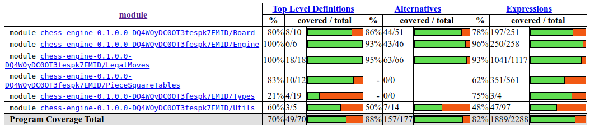

# Testausdokumentti

Ohjelman testauksessa on käytetty Hspec-kirjastoa. Testit ajetaan komennolla stack test ja testikattavuusraportin sa generoitua komennolla stack test --coverage.

### Testikattavuus

